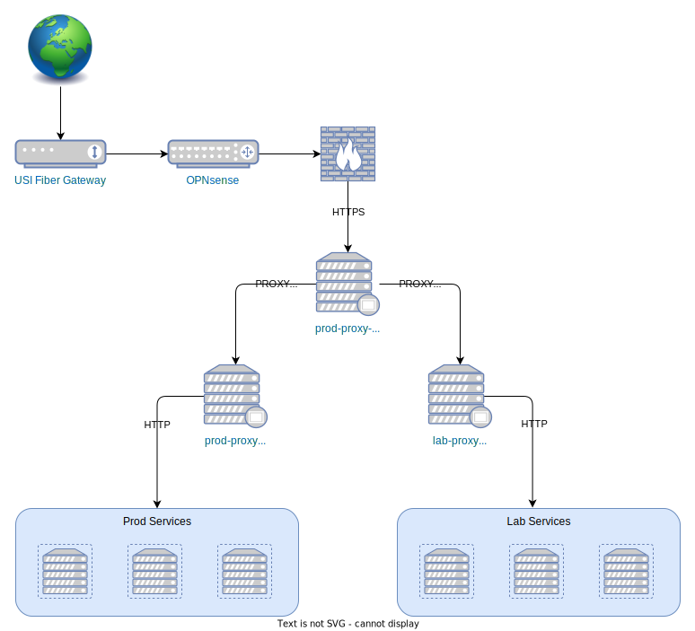

# prod-infrastructure

Terraform modules defining the Pegasus "homeprod" infrastructure.

## Network

- NAT port forwarding rules sends HTTP/HTTPS traffic to an nginx reverse proxy, `prod-proxy-passthrough`
- `prod-proxy-passthrough` passes it through to the upstream server(s)
- SNI is used to inspect the host name for a request without terminating TLS
- Requests for `*.lab.pegasuspad.com` are routed to an nginx reverse proxy for lab services, `lab-proxy`
- All other requests are routed to an nginx reverse proxy for production services, `prod-proxy`

This structure is depicted visually below:

## Patterns and Conventions

### Glossary

- `data VM`: a data VM is a Proxmox virtual machine with no OS installed which is never intended to be booted. Instead, it is used to provisions disks that are attached to another (bootable) VM. The purpose of this is to allowable the bootable VM to be destroyed and recreated without losing the persistent disks. This pattern is illustrated in the documentation for our Terraform provider: https://registry.terraform.io/providers/bpg/proxmox/latest/docs/resources/virtual_environment_vm#example-attached-disks

### Naming Conventions

- Module names ending in `-vm` create a Proxmox VM. The VM name is the module name, excluding this suffix.

## Modules

### _config

Data module that has outputs for configuration options shared by all resources in the "prod" environment, such as Proxmox connection details, datastore types, user ssh keys, etc.

### lab-ansible-vm

Creates an Ansible control node that can be used to manage prod resources, as well as test Ansible provisioning changes before they are promoted to another environment.

### prod-proxy-passthrough-vm

Creates an nginx reverse proxy that serves as the main web entrypoint to our externally-accessible services. This proxy passes through TLS connections, and uses SNI to route requests to the appropriate environment-specific proxy (either `lab-proxy` or `prod-proxy`).
