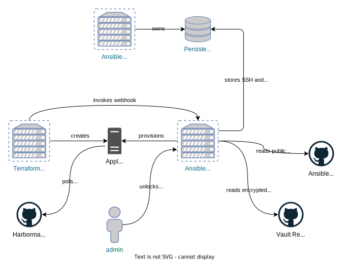

# prod-infrastructure

Terraform modules defining the Pegasus "homeprod" infrastructure.

## Network

- NAT port forwarding rules sends HTTP/HTTPS traffic to an nginx reverse proxy, `prod-proxy-passthrough`
- `prod-proxy-passthrough` passes it through to the upstream server(s)
- SNI is used to inspect the host name for a request without terminating TLS
- Requests for `*.lab.pegasuspad.com` are routed to an nginx reverse proxy for lab services, `lab-proxy`
- All other requests are routed to an nginx reverse proxy for production services, `prod-proxy`

This structure is depicted visually below:

## Provisioning and Configuration

New virtual machines are created using a two step process:

- Terraform is used to provision (i.e. create) the virtual machine and any dependencies.
- Ansible is then used to install and configure software on the machine.
- Ongoing configuration management is then performed by Ansible and/or Harbormaster.

The following diagram depicts the overall process, and the following sections describe the steps in more detail.

### Provisioning with Terraform

Terraform interfaces with the Proxmox server to create virtual machines and related resources (disk ISOs, cloud-init snippets, etc.). Terraform uses cloud-init to perform some minimal configuration of new hosts (creating a user for Ansible, installing required packages such as qemu-agent, etc.). In general, however, this configuration should be kept to a minimum. Specifically, Terraform _does not_ inject any secrets into newly provisioned VMs. This is to keep such secrets out of Terraform state, cloud-init metadata files, etc.

### Configuration with Ansible

Once a new host is provisioned, Terraform invokes a webhook on the Ansible control node and passes the name of the new host. This triggers the _provisoning_ process, where Ansible runs a playbook that installs the correct software on the VM and injects any secrets or other configuration. Some of the secrets stored on an Ansible node must be unlocked before they came be used for provisioning. This unlocking step must be completed manually by a human operator in an interactive terminal. As a result, there are several states the control node can be in, as depicted below:

A newly-provisioned control node must first be manually "bootstrapped" by an administrator, using a script installed during provisioning. This will result in a fully-provisioned, but "locked" state. An administrator must execute a script to unlock the node before it can accept webhooks or process other provisioning tasks. If the machine is rebooted for any reason, it will revert to a locked state and must manually be unlocked again.

### Ongoing Management

TBD - ansible playbook and gitops with Harbormaster

## Patterns and Conventions

### Glossary

- `data VM`: a data VM is a Proxmox virtual machine with no OS installed which is never intended to be booted. Instead, it is used to provisions disks that are attached to another (bootable) VM. The purpose of this is to allowable the bootable VM to be destroyed and recreated without losing the persistent disks. This pattern is illustrated in the documentation for our Terraform provider: https://registry.terraform.io/providers/bpg/proxmox/latest/docs/resources/virtual_environment_vm#example-attached-disks

### Naming Conventions

- Module names ending in `-vm` create a Proxmox VM. The VM name is the module name, excluding this suffix.

## Modules

### _config

Data module that has outputs for configuration options shared by all resources in the "prod" environment, such as Proxmox connection details, datastore types, user ssh keys, etc.

### lab-ansible-vm

Creates an Ansible control node that can be used to manage prod resources, as well as test Ansible provisioning changes before they are promoted to another environment.

### prod-proxy-passthrough-vm

Creates an nginx reverse proxy that serves as the main web entrypoint to our externally-accessible services. This proxy passes through TLS connections, and uses SNI to route requests to the appropriate environment-specific proxy (either `lab-proxy` or `prod-proxy`).
